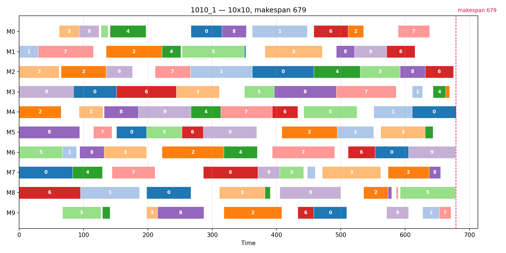
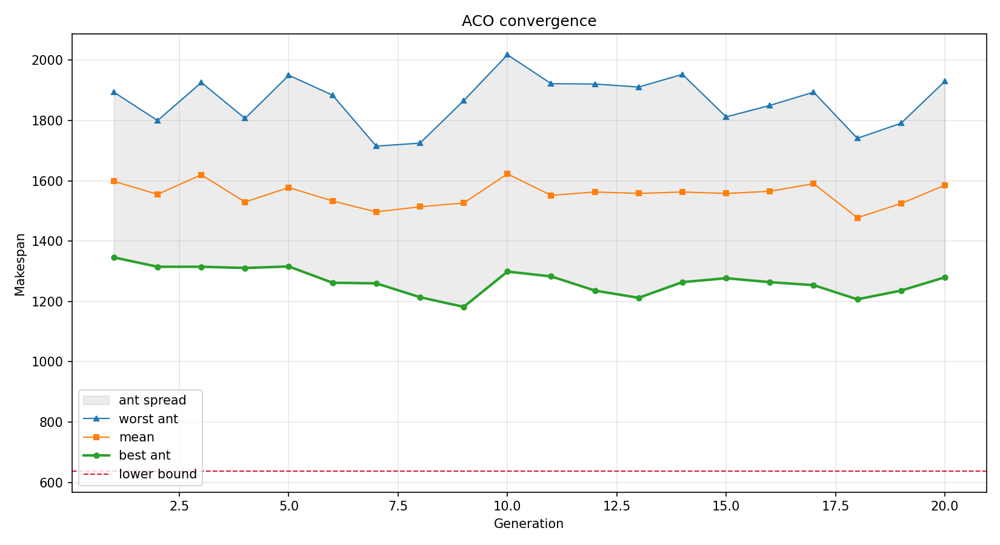

# ossp-aco — Ant Colony Optimization for Open-Shop Scheduling

[](https://github.com/SaeedSabzeh/ossp-aco/actions/workflows/ci.yml)
[](https://www.python.org/)
[](LICENSE)

A hybrid metaheuristic for minimising **makespan** on the Open-Shop Scheduling Problem:
pheromone-guided construction (ACO) followed by iterated local search, benchmarked over
22 instances from 4×4 to 10×10.

In the OSSP every job must run once on every machine, but — unlike flow-shop or job-shop —
**the order of operations within a job is free**. That freedom is what makes it hard: the
problem is NP-hard for three or more machines.



*A solved 10×10 instance: one row per machine, bars coloured by job, makespan 679 against a
lower bound of 637.*

## Results

Benchmarked against **Taillard's published upper bounds**, using the parameters from the
original study (α=1, β=1, ρ=0.1, τ₀=1, 25 ants, 200 generations, elite 2/3, generation 1/3),
best of 3 seeds. "v1" is the previous implementation's published result on the same
instances; "dev" is deviation from the upper bound.

| Instance | Taillard UB | v1 | dev | **v2** | dev | gain |
| --- | ---: | ---: | ---: | ---: | ---: | ---: |
| 4×4-1 | 193 | 193 | 0.0% | **193** | 0.0% | — |
| 4×4-2 | 236 | 241 | 2.1% | **236** | 0.0% | +5 |
| 4×4-3 | 271 | 271 | 0.0% | **272** | 0.4% | −1 |
| 4×4-4 | 250 | 253 | 1.2% | **252** | 0.8% | +1 |
| 4×4-5 | 295 | 295 | 0.0% | **295** | 0.0% | — |
| 4×4-6 | 189 | 193 | 2.1% | **189** | 0.0% | +4 |
| 4×4-7 | 201 | 203 | 1.0% | **201** | 0.0% | +2 |
| 4×4-8 | 217 | 220 | 1.4% | **217** | 0.0% | +3 |
| 4×4-9 | 261 | 267 | 2.3% | **261** | 0.0% | +6 |
| 4×4-10 | 217 | 221 | 1.8% | **221** | 1.8% | — |
| 5×5-1 | 300 | 300 | 0.0% | **308** | 2.7% | −8 |
| 5×5-2 | 262 | 266 | 1.5% | **261** | −0.4% | +5 |
| 5×5-3 | 328 | 337 | 2.7% | **331** | 0.9% | +6 |
| 5×5-4 | 310 | 332 | 7.1% | **318** | 2.6% | +14 |
| 5×5-5 | 329 | 348 | 5.8% | **333** | 1.2% | +15 |
| 7×7-1 | 438 | 477 | 8.9% | **450** | 2.7% | +27 |
| 7×7-2 | 449 | 505 | 12.5% | **460** | 2.4% | +45 |
| 7×7-3 | 479 | 510 | 6.5% | **496** | 3.5% | +14 |
| 7×7-4 | 467 | 489 | 4.7% | **473** | 1.3% | +16 |

| Size | v1 mean dev | v2 mean dev | v2 better on |
| --- | ---: | ---: | ---: |
| 4×4 | 1.20% | **0.30%** | 6 of 10 |
| 5×5 | 3.43% | **1.40%** | 4 of 5 |
| 7×7 | 8.14% | **2.51%** | 4 of 4 |
| **all** | **3.25%** | **1.05%** | **14 of 19** |

Instances matching or beating the published upper bound: **4 → 8**.

The gain grows with instance size — negligible at 4×4, decisive at 7×7 — which is what you
would expect if the binding constraint is local-search quality rather than construction.

**5×5-2 lands at 261, one below Taillard's published 262.** That bound was his 1993 taboo
search result against a lower bound of 255, so it was never proven optimal. The schedule is
verified feasible by an independent checker (every operation once per machine, no machine or
job overlap, exact durations).

Two instances regressed: 4×4-3 by 1 and 5×5-1 by 8. Both are cases where v1 reported hitting
the published bound exactly. Three seeds is not an exhaustive search and neither result is
evidence of a defect, but they are reported here rather than omitted.

### 10×10

The original study published no 10×10 results, and I had no published upper bounds for these,
so they are reported against the trivial lower bound (busiest machine / longest job). Settings
differ from the table above: 20 generations, best of 3 seeds, `max_stalls=10`.

| Instance | LB | ACO | ACO + LS | gain from LS | gap to LB |
| --- | ---: | ---: | ---: | ---: | ---: |
| 1010_1 | 637 | 1153 | **679** | 41.1% | 6.6% |
| 1010_2 | 588 | 1005 | **619** | 38.4% | 5.3% |
| 1010_3 | 598 | 1014 | **636** | 37.3% | 6.4% |

Because the lower bound is not the optimum, these gaps are upper bounds on the true gaps.

Raw per-seed data is in [`results/benchmark.csv`](results/benchmark.csv).



*Convergence on 1010_1. The colony's best, mean and worst ant per generation — the spread
narrows as pheromone concentrates on good transitions.*

## Quickstart

```bash
git clone https://github.com/SaeedSabzeh/ossp-aco.git
cd ossp-aco
python -m venv .venv && source .venv/bin/activate
pip install -e ".[dev]"

ossp solve instances/44_1.txt --plot        # solve one, write charts
ossp bench instances/ --seeds 0 1 2 --markdown   # full benchmark table
make test                                    # 37 tests
```

```python
from ossp import ACO, ACOParams, Instance, iterated_local_search

instance = Instance.from_file("instances/1010_1.txt")
result = ACO(instance, ACOParams(n_ants=25, n_generations=20)).run(seed=0)
refined = iterated_local_search(instance, result.sequence, max_stalls=30)

print(result.makespan, "->", refined.makespan, "| lower bound", instance.lower_bound)
```

## How it works

**Encoding.** A solution is a permutation of the `n_jobs × n_machines` operations. Operation
`o` means job `o // n_machines` on machine `o % n_machines`.

**Decoding.** The permutation is turned into a semi-active schedule greedily: each operation
starts at the earliest time both its machine and its job are free. This is O(operations) and
independent of the magnitude of the processing times.

**Construction (ACO).** Each ant walks the operations from a virtual start node, choosing the
next with probability proportional to `τ^α · η^β` — pheromone on the transition, times a
heuristic `η = 1 / processing time` that biases towards scheduling short operations early.

**Reinforcement.** Each generation, all pheromone evaporates by `(1 − ρ)`, then the all-time
best deposits `ρ · elite_reward` and the generation best deposits `ρ · generation_reward`.
Splitting the deposit keeps the colony exploring instead of locking onto the first decent
schedule it finds.

**Refinement (ILS).** The best sequence is then improved by best-improvement descent over
pairwise swaps, restarted from a random k-swap perturbation whenever the descent stalls, and
terminated after `max_stalls` non-improving restarts.

```
src/ossp/
├── instance.py      loading, decoding, makespan, lower bound
├── aco.py           ACOParams, pheromone matrix, construction, reinforcement
├── local_search.py  descent, perturbation, ILS
├── benchmark.py     multi-instance / multi-seed runner, CSV + markdown output
├── plotting.py      Gantt and convergence charts
└── cli.py           `ossp solve` / `ossp bench`
```

## Parameters

| Parameter | Default | Meaning |
| --- | --- | --- |
| `alpha` | 1.0 | pheromone exponent — raise to follow the trail harder |
| `beta` | 1.0 | heuristic exponent — raise to favour short operations |
| `rho` | 0.1 | evaporation rate per generation |
| `tau0` | 1.0 | initial pheromone on every transition |
| `n_ants` | 25 | solutions constructed per generation |
| `n_generations` | 20 | generations per run |
| `elite_reward` | 2/3 | share deposited by the all-time best |
| `generation_reward` | 1/3 | share deposited by the generation best |
| `max_stalls` | 30 | non-improving ILS restarts before stopping |

All are settable on the CLI (`--alpha`, `--ants`, …) or via `ACOParams`, which validates them
rather than failing silently later.

## Instance format

One row per job, one column per machine; entry *(i, j)* is the processing time of job *i* on
machine *j*.

```
34  2 54 61
15 89 70  9
38 19 28 87
95  7 34 29
```

Named `{jobs}{machines}_{index}.txt`, so `1010_2.txt` is the second 10×10.

## Notes on correctness

This is a rewrite of an earlier version of this project
([original repository](https://github.com/SaeedSabzeh/Solving-Open-Shop-Scheduling-Problem-Via-Ant-Colony-Optimization)).
Four defects were found and fixed, each now pinned by a regression test:

**The local search corrupted its own incumbent.** The swap helper mutated the array in place
and returned the same object, so every *rejected* neighbour stayed applied while the recorded
best cost did not move. The search drifted away from its own best solution and reported a
makespan that did not belong to the schedule it returned — biased optimistic. Now the helper
returns a copy, and `test_descent_reported_cost_matches_returned_solution` asserts the
returned sequence actually costs what is claimed.

**A homoglyph disabled a parameter.** The elite reward was read with the key
`'OverallـBestـSolutionـReward'`, which contains U+0640 ARABIC TATWEEL rather than
underscores. The lookup never matched the configured value and silently fell back to a
default. Invisible in an editor, so `test_reward_keys_are_plain_ascii` asserts it instead.

**The convergence plot destroyed its own input.** The history JSON was opened with mode `'w'`
— which truncates — and then read. The plot never rendered, and each run wiped the data.

**The reward shares were crossed.** The all-time best received the generation share and vice
versa, making the search more exploratory than the configuration implied.

The decoder was also rewritten. The original built explicit per-timeslot lists, making it
O(makespan) per evaluation; the semi-active decoder here is O(operations). On identical
permutations both produce **identical makespans**, so results remain comparable — but
evaluation is roughly 11,000× faster on 10×10, which is what made the benchmark above
practical to run at all.

### What the fixes were worth

Mean deviation from Taillard's upper bounds fell from **3.25% to 1.05%** across the 19
instances, and the number matching or beating the published bound doubled from 4 to 8. The
first defect above accounts for most of that: with the incumbent no longer corrupted, the
descent explores the swap neighbourhood it was always meant to. The effect scales with
instance size (0.9 points at 4×4, 5.6 points at 7×7), because a corrupted incumbent costs
more the larger the neighbourhood being searched.

The first defect also means v1's reported makespans were not guaranteed to belong to the
schedules it returned, and the bias ran optimistic. Of v1's 19 published results, 17 were
independently reproduced here as achievable; the two exceptions are noted above.

## Testing

```bash
pytest -q                    # 37 tests
pytest --cov=ossp
```

Beyond the regression tests, the suite checks the properties that matter for a scheduler:
decoded schedules never double-book a machine or a job, every operation appears exactly once,
no solution ever beats the lower bound, descent reaches a genuine swap-local optimum, and
seeded runs are reproducible.

## Roadmap

- [ ] Insertion and 3-exchange neighbourhoods alongside pairwise swap
- [ ] Obtain published bounds for the 10×10 set and report deviation rather than LB gap
- [ ] Parallel ant construction across cores
- [ ] Parameter sweep over α, β, ρ with statistical comparison
- [ ] Vectorised or Numba-compiled descent for instances above 10×10

## License

MIT — see [LICENSE](LICENSE).
